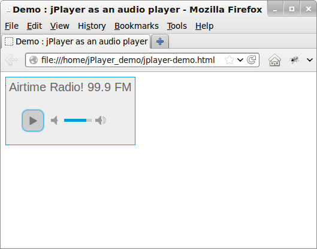

If you are using Airtime with Icecast or SHOUTcast for web streaming, you can embed a player applet into your website. **jPlayer** is a player applet (available under the GNU GPL from <http://jplayer.org/>) which uses the *&lt;audio&gt;* tag feature of HTML5 to play your streams. If the listener's browser does not support HTML5, the applet falls back to using Adobe Flash for MP3 format streams.

Proprietary browsers, such as Internet Explorer on Windows or Safari on Apple OS X, may not support Ogg Vorbis or Opus streams. Listeners who do not wish to install a browser with Ogg support (such as **Mozilla Firefox**, **Google Chrome** or **Opera**) can listen to these streams using a separate media player such as **VideoLAN Client**, also known as VLC (<http://www.videolan.org/vlc/>).

Example code
------------

You can download the example code for this chapter from:

[http://sourcefabric.booktype.pro/airtime-25-for-broadcasters/help/static/jPlayer\_demo4.zip](../help/static/jPlayer_demo4.zip "jPlayer demo files")

Unzip this file on your computer, and then open the file *jplayer-demo.html* in your editor:

    nano jplayer-demo.html

We'll focus on the two areas that you need to concern yourself with. Firstly, in the *&lt;head&gt;* tag of the document, you'll see some code like this:

      $("#jquery_jplayer_1").jPlayer({ 
          ready: function (event) { 
              $(this).jPlayer("setMedia", { 
                  oga:"http://sourcefabric.out.airtime.pro:8000/sourcefabric_a" 
              }); 
          }, 
          swfPath: "js", 
          supplied: "oga", 
          wmode: "window", 
          smoothPlayBar: true, 
          keyEnabled: true 
      });

This code loads jPlayer, and specifies the source of an Ogg Vorbis stream. When testing on your own server, you should change this setting to the IP address or domain name, port number and mount point of the Icecast server you are using, like so:

    oga: "http://streaming.example.com:8000/airtime_128"

If your stream is in MP3 format, you will need to prefix the stream setting with mp3, like this:

    mp3: "http://streaming.example.com:8000/airtime_128"

and change the *supplied* line from:

        supplied: "oga"

to:

        supplied: "mp3"

As soon as jPlayer has finished loading, it will automatically begin to play the stream. The parameters *ready*, *ended*, *swfPath* and *supplied* are arguments passed to jPlayer. A full list of constructor arguments is available in the *jPlayer Developer Guide* at <http://www.jplayer.org/latest/developer-guide/>

jPlayer controls
----------------

Secondly, the *&lt;body&gt;* tag of the file *jplayer-demo.html* defines the controls displayed by jPlayer. These controls can be as simple as just one Play/Pause button, or a fully-fledged playback interface with a playlist, progress bar and volume control. This example code uses one of the simpler skins available for jPlayer, *Blue Monday*.

A stop button or progress bar is not useful when we are streaming continuously from Icecast or SHOUTcast, so we can remove these tags from the demo code, along with the tags specifying the playback time and file duration. The simplified HTML creates a play/pause button and a mute button, and looks as follows:

    <ul class="jp-controls"> 
      <li><a href="javascript:;" class="jp-play" tabindex="1">play</a></li> 
      <li><a href="javascript:;" class="jp-pause" tabindex="1">pause</a></li> 
      <li><a href="javascript:;" class="jp-mute" tabindex="1" title="mute">mute</a></li> 
      <li><a href="javascript:;" class="jp-unmute" tabindex="1" title="unmute">unmute</a></li> 
      <li><a href="javascript:;" class="jp-volume-max" tabindex="1" title="max volume">max volume</a></li> 
    </ul>

When you open the HTML file *jplayer-demo.html* in a web browser, your player should appear as follows:

The original version of this demo code and skin are available from <http://jplayer.org/download/> for further experimentation.
